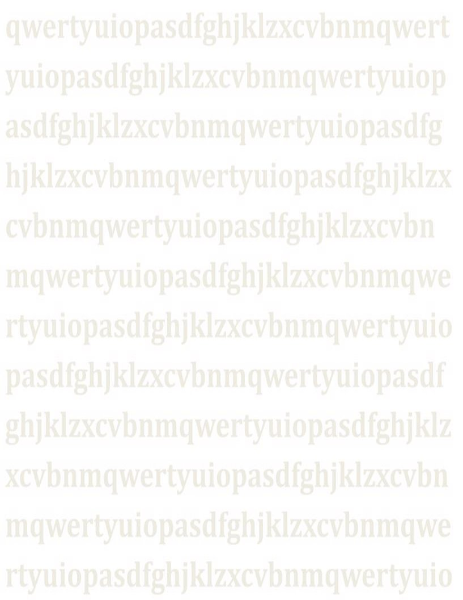

**1.4 Instalación de zonas secundarias con Windows Server.**

Cambiando nombre al equipo.

Cambiando la configuracion IP

En la zona directo añadimos benskywalker como soa para transferir esta zona.

Igual con la zona secundaria.

**CONFIGURACIÓN DE LAS ZONAS DEL SERVIDOR DNS SECUNDARIO.**

Añadimos la zona directa como secundario (que se ve en el tipo de la zona).

Añadimos tambien la zona inversa también como secundario (tipo de la zona)

**CONFIGURACIÓN DE LAS ZONAS DEL DNS PRIMARIO.**

Zona primaria del DNS primario.

Zona secundaria del DNS primario.

2. **ENGADE UN REXISTRO TIPO A (YADDLE 192.168.20.107) NA ZONA DE RESOLUCIÓN DIRECTA E TAMÉN NA DE RESOLUCIÓN INVERSA. ADXUNTA CAPTURA DOS REXISTROS DA ZONA UNHA VEZ FEITA A TRANSFERENCIA.**

**AÑADIENDO NUEVO REGISTRO E INCREMENTANDO EL SOA PARA TRANSFERIR.**

Añadiendo en el maestro el registro yaddle. (Al marcar crear registro del puntero ptr asociado el registro de la zona inversa se crea automáticamente.

Verificando que el registro yaddle se creo correctamente en la zona inversa (automaticamente). **VERIFICANDO QUE SE TRANSFIERE EL REGISTRO YADDLE AL SECUNDARIO.**

Al actualizar la zona primaria el registro yaddle aparece transferido del maestro al DNS secundario.

Al actualizar la zona inversa el registro yaddle también aparece transferido del maestro al DNS secundario.

3. **FAI QUE NO EQUIPO BENSWKYWALKER SE ATOPE UNHA COPIA DA ZONA STARWARS.LAN, TRANSFERIDA DESDE DARTHVADER.**

Para transferir desde el Debian al windows 11 pero no funciona.

En el windows server las zonas aparecen como que no tranfieren por error.

4. **FAI QUE NO EQUIP DARTHSIDIOUS SE ATOPE UNHA COPIA DA ZONA ACADEMIA.JEDI TRANSFERIDA DESDE LUKESKYWALKER.**

Añadimos las zonas al secundario de debian (bind9) para transferir aunque despues falla.
