## 1.3 INSTALACION DE ZONAS SECUNDARIAS. 

### 1- Tomaremos a máquina darthsidious, e configuraremola para ser servidor secundario, 
### tanto da zona primaria de resolución directa como de resolución inversa. 
### Captura os ficheiros de configuración en ambalas dúas máquinas. 
### Fai unha captura onde se vexa o reinicio da máquina darthsidious, 
### no que se vexa no log dos dous equipos e que se fixo a transferencia de zona.

### FICHEROS DE CONFIGURACION SERVIDOR DNS MAESTRO

#### CONFIGURACION NAMED.CONF.LOCAL DEL DNS MAESTRO.
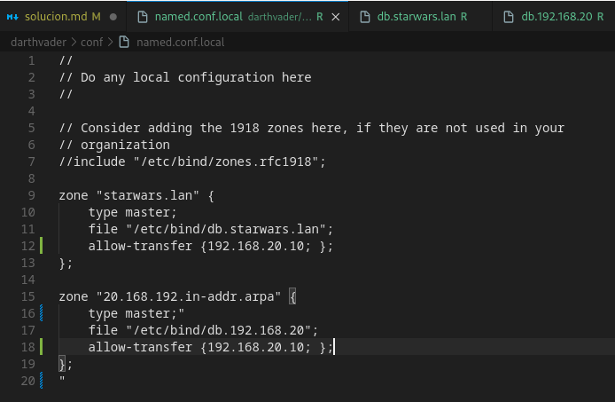
#### CONFIGURACION ZONA DIRECTA DEL DNS MAESTRO.
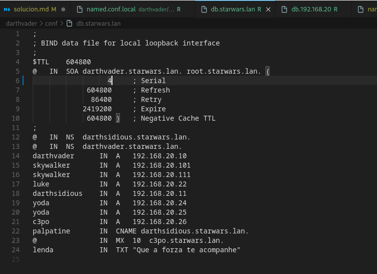
#### CONFIGURACION ZONA SECUNDARIA DEL DNS MAESTRO.
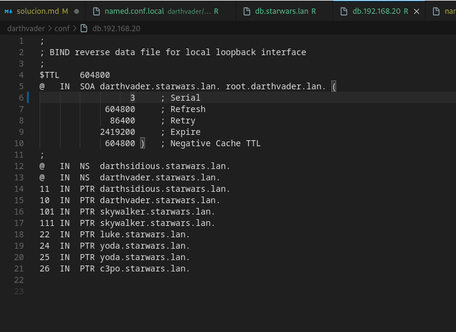

### FICHEROS DE CONFIGURACION SERVIDOR DNS ESCLAVO.

#### CONFIGURACION NAMED.CONF.LOCAL DEL DNS ESCLAVO.
.png)
#### CONFIGURACION ZONA DIRECTA DEL DNS ESCLAVO .
.png)
#### CONFIGURACION ZONA SECUNDARIA DEL DNS ESCLAVO.
.png)

### CAPTURAS DE TRANSFERENCIA DE ZONAS
#### PRIMER REINICIO TRAS EL CAMBIO DE SERIAL (SE TRANSFIEREN LAS ZONAS)
.png)

#### SI SE REINICIA EL SECUNDARIO NO SE TRANSFIERE NADA POR ESTAR ACTUALIZADO.
.png)

#### PROBANDO QUE LAS ZONAS SE TRANSFIEREN CORRECTAMENTE MANUALMENTE (POR COMANDO)
.png)

### 2- Engade un rexistro tipo A (Chewbacca 192.168.0.28) na zona de resolución directa e tamén na de resolución inversa.  
### Fai unha captura no momento do reinicio do equipo darthvader, no que se vexa o log dos dous equipos e que se amose que se fixo a transferencia de zona. Adxunta tamén unha captura do ficheiro de zona no servidor secundario.

#### AÑADIENDO NUEVO REGISTRO ZONA DIRECTA CHEWBACCA
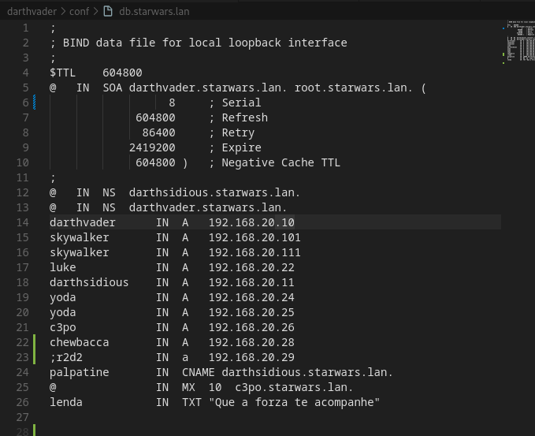

#### AÑADIENDO NUEVO REGISTRO ZONA INVERSA R2D2 
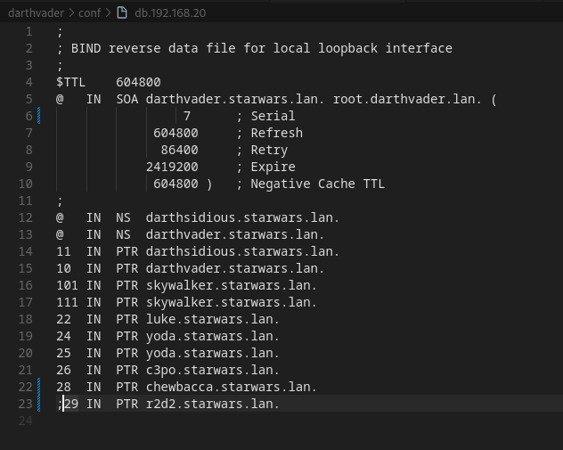

#### CAPTURAS DE TRANSFERENCIA DE ZONAS AL REINICIAR
.png)

#### TRANSFERENCIA DE ZONAS MANUALMENTE
##### ZONA DIRECTA
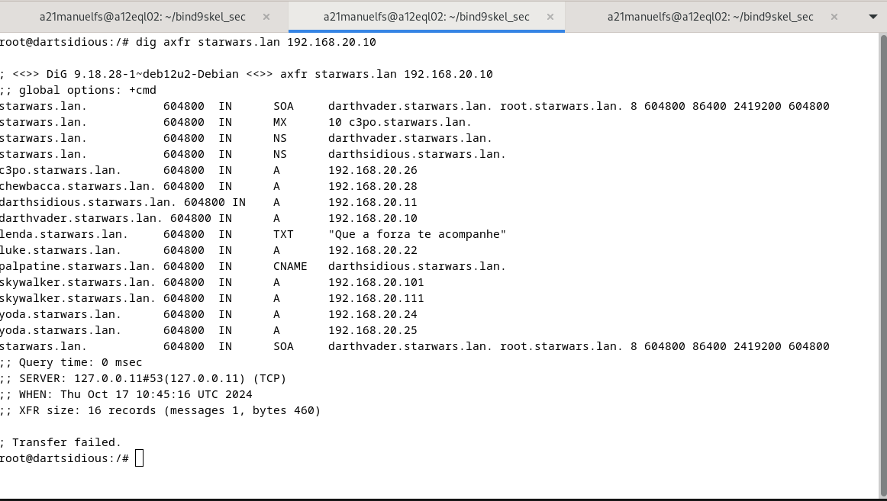

##### ZONA INVERSA
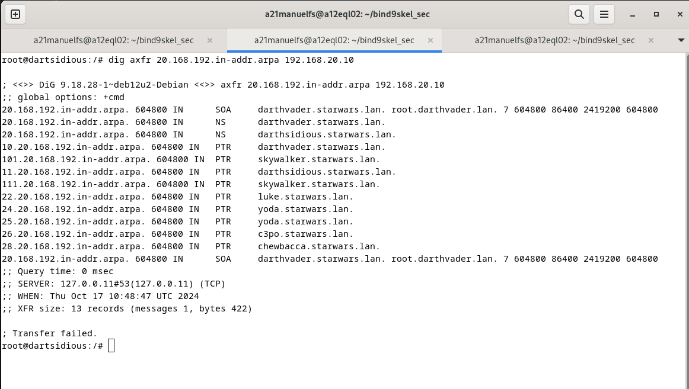

### 3- Comproba que o servidor secundario pode resolver ese nome.
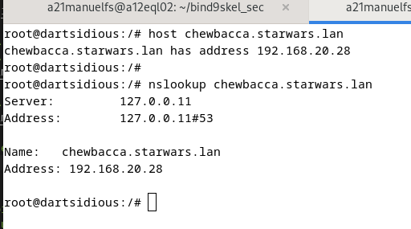

### 4- Fai os cambios necesarios para que as trasferencias se fagan de forma segura empregando chaves. 
### Repite as capturas e vídeos do punto 2, engadindo o rexistro r2d2 (192.168.0.29)

#### KEY EN EL MAESTRO
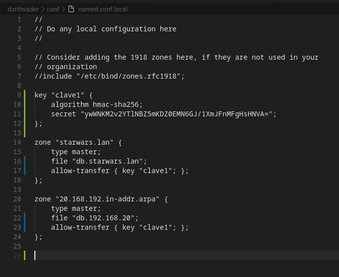

#### KEY EN EL ESCLAVO
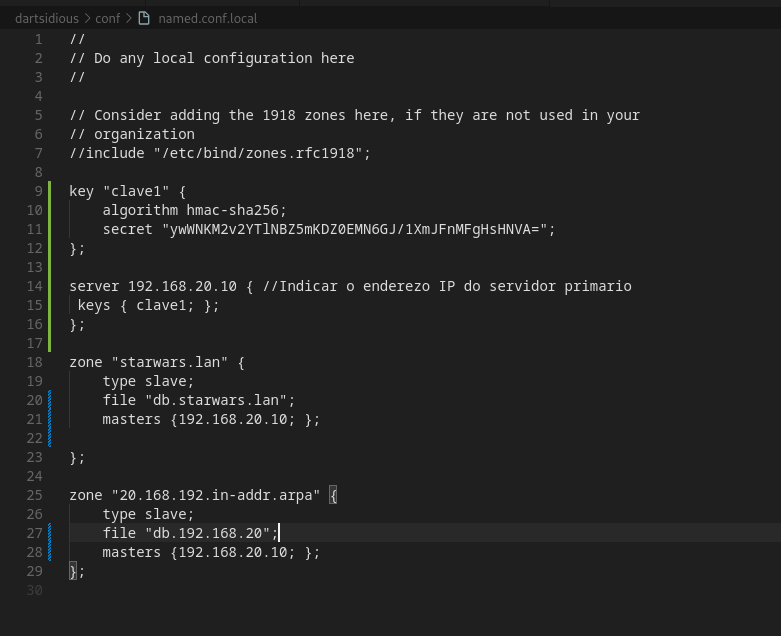

#### TRANSFERENCIA DE ZONAS CON CLAVE.
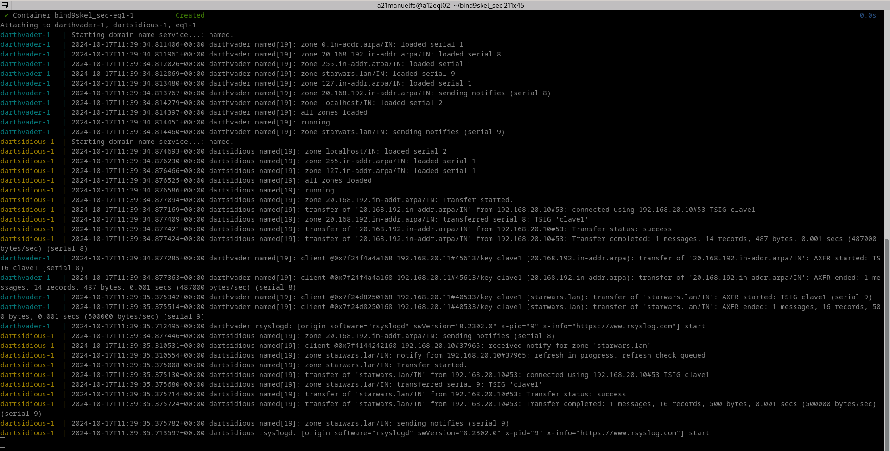

#### R2D2 EN ZONA DIRECTA

#### R2D2 EN ZONA INVERSA
[r2d2_inversa](imagenes\r2d2_inversa.png)
